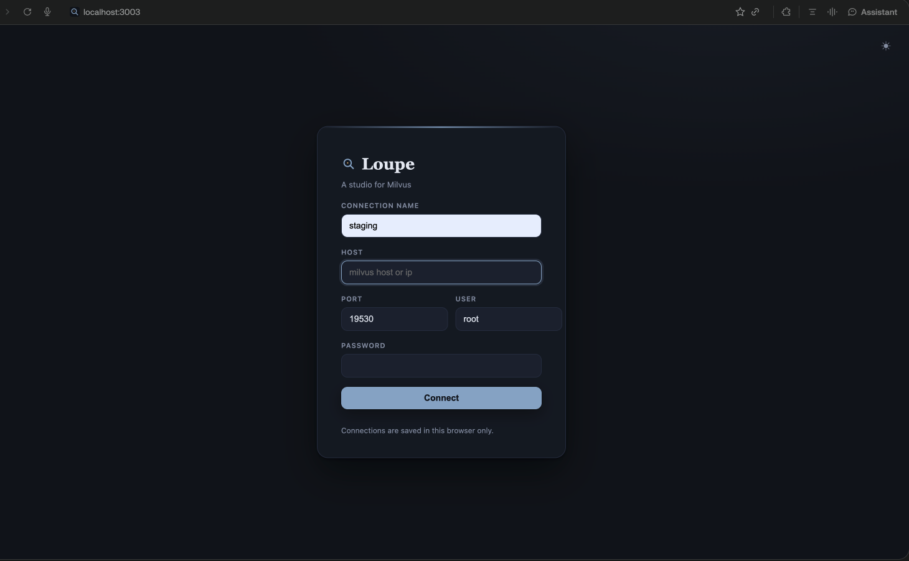

# Loupe

A studio for Milvus. One fast Rust binary that speaks the Milvus RESTful v2 API directly and embeds its whole UI. No SDK, no Node runtime, nothing else to install: run the 3MB binary bare, or pull the 20MB Docker image.



## Features

- Sign in page with saved connections, switch between any number of Milvus hosts
- Browse collections with live row counts and load state
- Inspect schemas: field types, vector dimensions, primary keys, indexes
- Query rows with Milvus filter expressions, paginated
- Sort by any column over the WHOLE collection, BigQuery style, something Attu does not have. Milvus has no ORDER BY, so Loupe streams primary keys plus the sort column in keyset batches, sorts once, caches the order, and pages by pk lookup (338K rows sort in about 5 seconds, cached pages are instant)
- Load and release collections
- Dark and light theme, follows the system and remembers your choice
- Read only by design: no insert, delete, or drop endpoints exist in the proxy

## Requirements

- Rust toolchain (stable) to build
- A Milvus 2.4+ server with the RESTful v2 API enabled (default on port 19530)

## Run

### Docker

```sh
docker run -p 3003:3003 ghcr.io/0xcynyx/loupe:latest
```

Then open http://127.0.0.1:3003 and sign in. Optionally prefill the form: add `-e MILVUS_HOST=... -e MILVUS_USER=... -e MILVUS_PASSWORD=...`.

Or with compose:

```yaml
services:
  loupe:
    image: ghcr.io/0xcynyx/loupe:latest
    ports:
      - "3003:3003"
```

### From source

```sh
cargo run --release
```

Then open http://127.0.0.1:3003 and sign in. Saved connections live in your browser's localStorage, never on the server.

## Configuration

All settings come from env vars, or from a file passed via ENV_FILE. Process env wins. These only prefill the first sign in form.

| Variable | Default | Purpose |
|---|---|---|
| MILVUS_HOST | empty | Prefill for the sign in form |
| MILVUS_PORT | 19530 | Prefill for the sign in form |
| MILVUS_USER | root | Prefill for the sign in form |
| MILVUS_PASSWORD | empty | Prefill for the sign in form |
| MILVUS_GUI_PORT | 3003 | Port Loupe listens on |
| MILVUS_GUI_BIND | 127.0.0.1 | Listen address, the Docker image sets 0.0.0.0 |
| MILVUS_GUI_ROW_CAP | 200 | Hard cap on rows per query page |
| MILVUS_GUI_SORT_CAP | 500000 | Max collection size for whole collection sort |

Example, reusing an existing service env file:

```sh
ENV_FILE=../backend-ai-langchain-python/.env cargo run --release
```

## Architecture

```
src/config.rs   settings resolution, env plus optional ENV_FILE
src/milvus.rs   MilvusApi trait plus the REST v2 client, the only Milvus aware module
src/api.rs      HTTP handlers, one session per connected host, keyed by X-Session
src/main.rs     wiring, routes, embedded static assets
web/            vanilla JS frontend, embedded into the binary at compile time
```

Loupe binds to 127.0.0.1 by default (0.0.0.0 inside Docker, publish the port only where you trust the network). Milvus credentials pass through process memory for the life of a session and are never written to disk by the server.

## License

MIT
